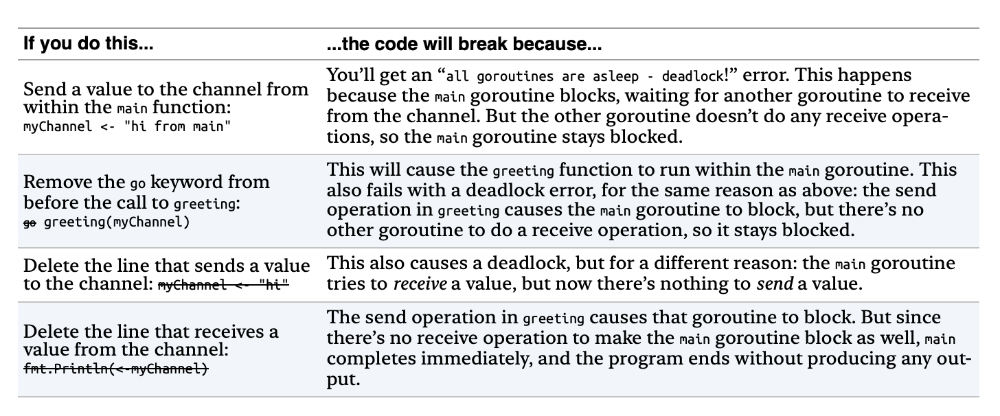

```go
func greeting(myChannel chan string) {
       myChannel <- "hi"
}

func main() {
       myChannel := make(chan string)
       go greeting(myChannel)
       fmt.Println(<-myChannel)
}
```



Excerpt From
Head First Go
Jay  McGavren